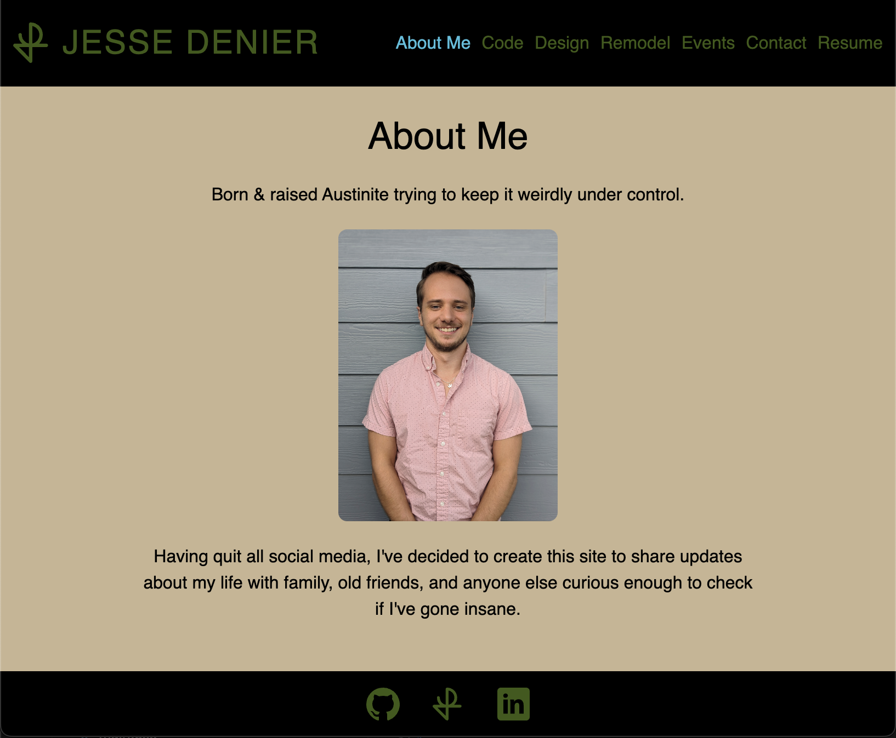

# React Portfolio

## Description

This is my personal portfolio site. It hosts examples of his work in coding, graphic design, event planning, and home remodeling as well as descriptions and a contact form.

This was created as a way for friends, family, and anyone else to follow my work and get in contact with me.

## Table of Contents

- [Installation](#installation)
- [Usage](#usage)
- [Credits](#credits)
- [License](#license)
- [Questions](#questions)

## Installation

No installation necesssary. Simply visit https://jesse-denier-portfolio.netlify.app/

## Usage

End Users can use this site by following the installation steps and then scrolling around and clicking on different elements.

The "Code" and "Remodels" sections will open up links to other projects on click, while the "Design" and "Events" sections will expand the selected image on click.

Additionally at the bottom the footer will bring you to my Github profile, personal website, or my LinkedIn profile..

Here is a screenshot from the completed site as of 5/15/24.

## Credits

This code was written entirely by Jesse Denier. ChatGPT was used for some minor bug identification and correction.

## License

This project is licensed under the terms of the MIT license. See the badge at the top of the README for more details.

## Questions

Feel free to reach out to me with any additional questions through the following methods:

Github Profile: https://www.github.com/JesseDenier

Using the footer at the bottom of the site.
